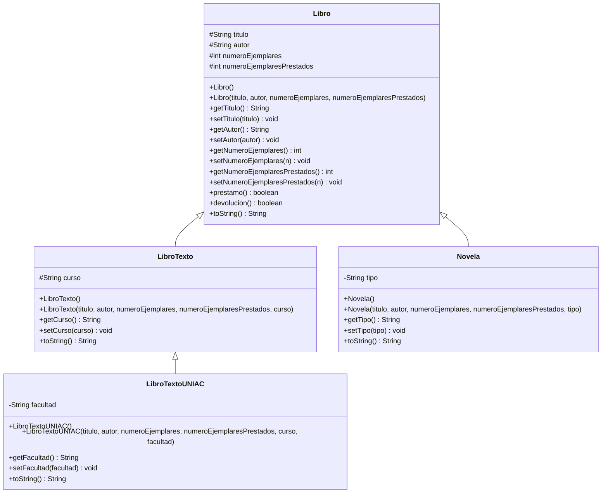

# Parcial Práctico I - Programación II (G412)

**Tema:** POO - Abstracción, Encapsulamiento y Herencia con Maven + Git

## Integrantes del grupo
- Nombre completo 1 Deibit Arley Urbano
- Nombre completo 2 Jefferson Paredes E
- Nombre completo 3 heidy Valentina Avendaño

> ⚠️ Reemplacen estos 3 nombres por los nombres completos reales de cada integrante antes de entregar. El profesor lo pide explícitamente.

## Descripción del proyecto
Sistema de gestión de biblioteca que maneja diferentes tipos de libros aplicando los tres pilares de la Programación Orientada a Objetos pedidos en el taller: **abstracción**, **encapsulamiento** y **herencia**.

## Diagrama UML de clases



## Estructura del proyecto (Maven)
```
parcial-practico-412/
├── pom.xml
├── README.md
└── src/main/java/com/biblioteca/
    ├── Libro.java
    ├── LibroTexto.java
    ├── LibroTextoUNIAC.java
    ├── Novela.java
    └── Main.java
```


## Respuestas teóricas heidy

### 2 situaciones donde no se podría aplicar herencia

1. **Atributos privados**: si en la clase `Libro` los atributos (`titulo`, `autor`, etc.) estuvieran declarados como `private` en vez de `protected`, la clase `Novela` no podría acceder a ellos directamente — solo a través de los métodos `get`/`set` heredados. Por ejemplo, un fragmento como este daría error de compilación:
```java
   // Dentro de Novela, si titulo fuera private en Libro:
   this.titulo = titulo; // ERROR: titulo no es visible desde la subclase
```

2. **Clase final**: si `Libro` se hubiera declarado como `public final class Libro`, Java no permitiría crear ninguna subclase (`LibroTexto`, `LibroTextoUNIAC`, `Novela`), ya que el modificador `final` en una clase impide que sea heredada.

### 2 atributos nuevos y un método adicional

- **isbn** (String): identificador único internacional del libro.
- **anioPublicacion** (int): año en que se publicó el libro.
- **Método nuevo: `estaDisponible()`**: retorna `boolean`, verdadero si `(numeroEjemplares - numeroEjemplaresPrestados) > 0`. Tiene sentido porque actualmente solo se sabe si hay ejemplares disponibles al intentar prestar uno; este método permite consultar la disponibilidad sin alterar el estado del objeto.
