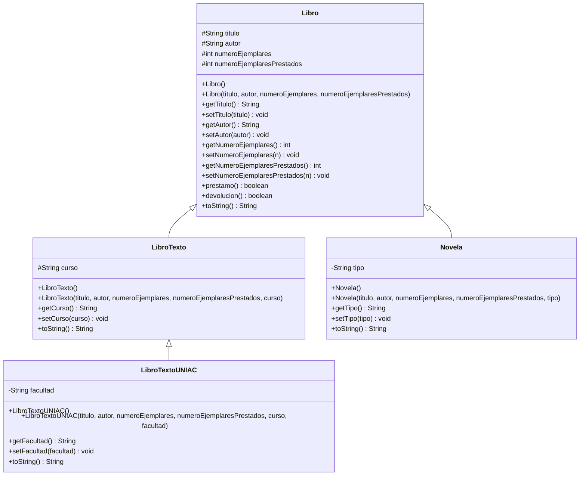

# Parcial Práctico I - Programación II (G412)

**Tema:** POO - Abstracción, Encapsulamiento y Herencia con Maven + Git

## Integrantes del grupo
- Nombre completo 1 (REEMPLAZAR)
- Nombre completo 2 (REEMPLAZAR)
- Nombre completo 3 (REEMPLAZAR)

> ⚠️ Reemplacen estos 3 nombres por los nombres completos reales de cada integrante antes de entregar. El profesor lo pide explícitamente.

## Descripción del proyecto
Sistema de gestión de biblioteca que maneja diferentes tipos de libros aplicando los tres pilares de la Programación Orientada a Objetos pedidos en el taller: **abstracción**, **encapsulamiento** y **herencia**.

## Diagrama UML de clases



## Estructura del proyecto (Maven)
```
parcial-practico-412/
├── pom.xml
├── README.md
└── src/main/java/com/biblioteca/
    ├── Libro.java
    ├── LibroTexto.java
    ├── LibroTextoUNIAC.java
    ├── Novela.java
    └── Main.java
```

## Cómo ejecutar el proyecto
Con Maven instalado, desde la raíz del proyecto:
```
mvn compile
mvn exec:java
```
O, sin Maven, compilando directo con javac:
```
javac -d out src/main/java/com/biblioteca/*.java
java -cp out com.biblioteca.Main
```
El programa pedirá por consola los datos de `libro2` (título, autor, número de ejemplares y número de ejemplares prestados).

## Objetos creados en Main.java
1. `libro1`: creado con el constructor que recibe parámetros.
2. `libro2`: creado con el constructor vacío y luego se completan sus datos pidiéndolos por consola.
3. `libroTextoUNIAC`: creado con todos sus atributos (incluye curso y facultad).
4. `novela`: creada indicando su tipo (por ejemplo, "aventuras").

Sobre estos objetos se prueban los métodos `prestamo()` y `devolucion()`.

---

## 2 situaciones donde NO se podría realizar la herencia

Estas dos situaciones son teóricas (para responder el punto del taller), no están aplicadas en el código que sí funciona, sino que muestran fragmentos donde la herencia se rompería:

### Situación 1: Constructor con modificador `private`
```java
public class Libro {
    private Libro(String titulo, String autor, int numeroEjemplares, int numeroEjemplaresPrestados) {
        ...
    }
}
```
**Falla:** si el constructor de `Libro` fuera `private`, ninguna clase (ni siquiera `LibroTexto`) podría llamar a `super(...)` desde su propio constructor, porque un constructor privado solo es visible dentro de la misma clase. Esto rompería la herencia por completo, ya que Java exige que la clase hija pueda invocar algún constructor accesible de la clase padre.

### Situación 2: Clase declarada como `final`
```java
public final class Libro {
    ...
}
```
**Falla:** la palabra clave `final` en la declaración de una clase impide explícitamente que cualquier otra clase la extienda. Si `Libro` fuera `final`, el compilador marcaría error en `public class LibroTexto extends Libro`, porque Java no permite heredar de clases finales.

## 2 nuevos atributos y 1 método adicional propuestos
- **Atributo `editorial` (String):** para saber qué editorial publicó el libro.
- **Atributo `anioPublicacion` (int):** para saber el año en que se publicó el libro.
- **Método `estaDisponible()` (boolean):** retorna `true` si `numeroEjemplares - numeroEjemplaresPrestados > 0`, es decir, si queda al menos un ejemplar disponible para prestar. Tiene sentido porque hoy en día hay que restar manualmente para saber si un libro está disponible; este método simplifica esa consulta.

---

## Flujo de Git seguido por el grupo
- Ningún commit se hizo directo sobre `main`/`master`; todo se integró mediante **Pull Request** desde una rama nueva.
- Cada integrante realizó un mínimo de 2 commits desde su propia rama.
- El repositorio se llama exactamente `parcial-practico-412`, tal como lo pidió el profesor.
