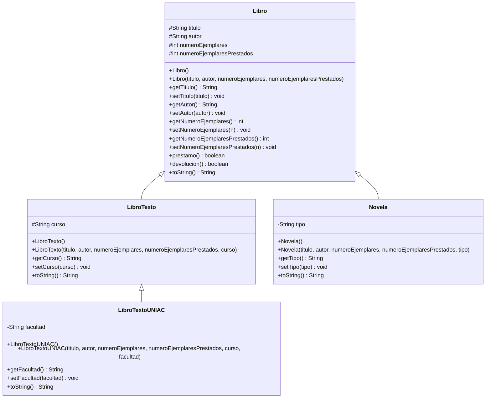

# Parcial Práctico I - Programación II (G412)

**Tema:** POO - Abstracción, Encapsulamiento y Herencia con Maven + Git

## Integrantes del grupo
- Nombre completo 1 Deibit Urbano
- Nombre completo 2 (REEMPLAZAR)
- Nombre completo 3 (REEMPLAZAR)

> ⚠️ Reemplacen estos 3 nombres por los nombres completos reales de cada integrante antes de entregar. El profesor lo pide explícitamente.

## Descripción del proyecto
Sistema de gestión de biblioteca que maneja diferentes tipos de libros aplicando los tres pilares de la Programación Orientada a Objetos pedidos en el taller: **abstracción**, **encapsulamiento** y **herencia**.

## Diagrama UML de clases



## Estructura del proyecto (Maven)
```
parcial-practico-412/
├── pom.xml
├── README.md
└── src/main/java/com/biblioteca/
    ├── Libro.java
    ├── LibroTexto.java
    ├── LibroTextoUNIAC.java
    ├── Novela.java
    └── Main.java
```

